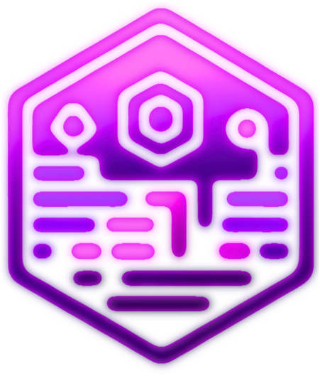

<!--
Hey, thanks for using the awesome-readme-template template.  
If you have any enhancements, then fork this project and create a pull request 
or just open an issue with the label "enhancement".

Don't forget to give this project a star for additional support ;)
Maybe you can mention me or this repo in the acknowledgements too
-->
<div align="center">

  
  <h1>CodySynthAI</h1>
  <p>CodeSynthAI is an experimental open-source project that explores the potential of AI-powered Python scripting. By combining Large Language Models (LLMs) with a multi-agent system.</p>
  
<!-- Badges -->
<p>
  <a href="https://github.com/peterzervas/CodeSynthAI/graphs/contributors">
    
  </a>
  <a href="">
    
  </a>
  <a href="https://github.com/peterzervas/CodeSynthAI/network/members">
    
  </a>
  <a href="https://github.com/peterzervas/CodeSynthAI/stargazers">
    
  </a>
  <a href="https://github.com/peterzervas/CodeSynthAI/issues/">
    
  </a>
  <a href="https://github.com/peterzervas/CodeSynthAI/blob/master/LICENSE">
    
  </a>
</p>

<h4>
  <a href="https://github.com/peterzervas/CodeSynthAI/issues/">Report Bug</a>
  <span> · </span>
  <a href="https://github.com/peterzervas/CodeSynthAI/issues/">Request Feature</a>
</h4>
</div>

<br />

## :notebook_with_decorative_cover: Table of Contents

- [About the Project](#star2-about-the-project)
- [Screenshots](#camera-screenshots)
- [Tech Stack](#space_invader-tech-stack)
- [Features](#dart-features)
- [Environment Variables](#key-environment-variables)
- [Getting Started](#toolbox-getting-started)
- [Prerequisites](#bangbang-prerequisites)
- [Installation](#gear-installation)
- [Usage](#eyes-usage)
- [Roadmap](#compass-roadmap)
- [Contributing](#wave-contributing)
<!-- - [Code of Conduct](#scroll-code-of-conduct) -->
<!-- - [FAQ](#grey_question-faq) -->
- [License](#warning-license)
<!-- - [Contact](#handshake-contact) -->
- [Acknowledgements](#gem-acknowledgements)

<!-- About the Project -->
## :star2: About the Project
CodeSynthAI is an experimental proof-of-concept (POC) project that explores the potential of AI-assisted code generation using a multi-agent system. It aims to streamline the process of creating Python scripts by leveraging the power of Large Language Models (LLMs) and collaborative AI agents.

### Project Status

Please note that CodeSynthAI is currently a work in progress (WIP) and is in its early stages of development. The project serves as an initial exploration of the concept and is not yet a fully-fledged solution. The code generated by CodeSynthAI may vary in quality and reliability, and it should be thoroughly reviewed and tested before being used in any production environment.

<!-- Screenshots -->
### :camera: Screenshot(s)


<!-- TechStack -->
### :space_invader: Tech Stack

<details>
  <summary>Language</summary>
  <ul>
    <li><a href="https://www.python.org/">Python</a></li>
  </ul>
</details>

<details>
  <summary>Libraries and Tools</summary>
  <ul>
    <li><a href="https://www.anthropic.com/">Anthropic API</a></li>
    <li><a href="https://python.langchain.com/en/latest/">LangChain</a></li>
    <li><a href="https://github.com/hwchase17/langchain-experiments">LangChain Experimental</a></li>
    <li><a href="https://crewai.co/">CrewAI</a></li>
    <li><a href="https://streamlit.io/">Streamlit</a></li>
    <li><a href="https://openai.com/">OpenAI API</a></li>
    <li><a href="https://www.pinecone.io/">Pinecone</a></li>
  </ul>
</details>

<!-- Features -->
### :dart: Features

- AI-assisted Python script generation
- Multi-agent collaboration for code refinement
- Integration with OpenAI embeddings and Pinecone vector store
- User-friendly Streamlit interface
- Iterative development process

<!-- Env Variables -->
### :key: Environment Variables

TBA

<!-- Getting Started -->
## :toolbox: Getting Started

<!-- Prerequisites -->
### :bangbang: Prerequisites

- Python 3.7+
- OpenAI API key
- Anthropic API key
- Pinecone API key

<!-- Installation -->
### :gear: Installation

1. Clone the repository:
   ```bash
   git clone https://github.com/peterzervas/CodeSynthAI.git
   cd CodeSynthAI
2. Clone the repository:
   ```bash
   pip install -r requirements.txt
3. Set up the necessary API keys:
    ```bash
    OpenAI: Set the OPENAI_API_KEY environment variable.
    Anthropic: Set the ANTHROPIC_API_KEY environment variable.
    Pinecone: Set the PINECONE_API_KEY and PINECONE_ENVIRONMENT environment variables.

### :running: Run Locally

1. Start the Streamlit app
    ```bash
    streamlit run app.py
    or
    python -m streamlit run app.py
<!-- Usage -->
## :eyes: Usage

Enter your script requirements in the text area provided in the Streamlit app.
Click on "Generate Code" to initiate the code generation process.
Review and confirm the refined requirements.
Click on "Start Scripting" to begin the iterative scripting process.
Provide feedback on the generated code by selecting "👍 Thumbs Up" or "👎 Thumbs Down" and click "Submit Feedback and Add to Vector Store" to store the code snippet and feedback.

<!-- Roadmap -->
## :compass: Roadmap

- [x] Initial proof-of-concept release
- [ ] Requirements
- [ ] Expand support to other programming languages
- [ ] Improve code quality and reliability
- [ ] Integrate with version control systems
- [ ] Explore more advanced AI techniques and models
<!-- Contributing -->
## :wave: Contributing
<a href="https://github.com/peterzervas/CodeSynthAI/graphs/contributors">
  
</a>

Made with [contrib.rocks](https://contrib.rocks).

Contributions are always welcome!

See `contributing.md` for ways to get started.

<!-- License -->
## :globe_with_meridians: License

Distributed under the MIT License. See LICENSE for more information.

<!-- Contact
## :handshake: Contact

<!-- Acknowledgments -->
## :gem: Acknowledgements
- [LangChain](https://www.langchain.com/)
- [CrewAI](https://www.crewai.com/)
- [AgentCoder](https://arxiv.org/html/2312.13010v2)
- [Awesome README](https://github.com/matiassingers/awesome-readme)
- [What's next for AI agentic workflows ft. Andrew Ng of AI Fund](https://www.youtube.com/watch?v=sal78ACtGTc&ab_channel=SequoiaCapital)
